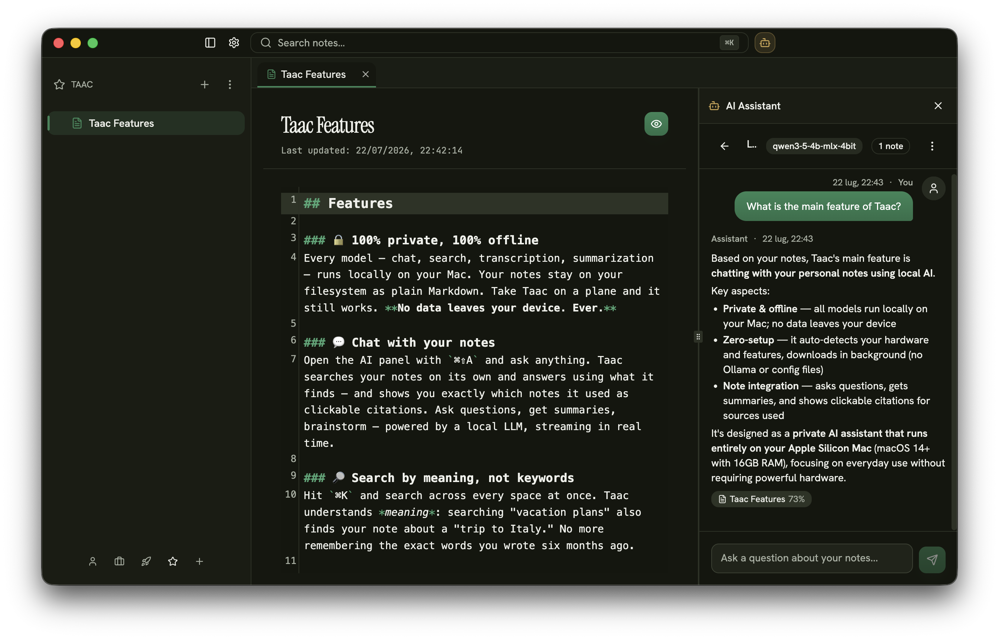
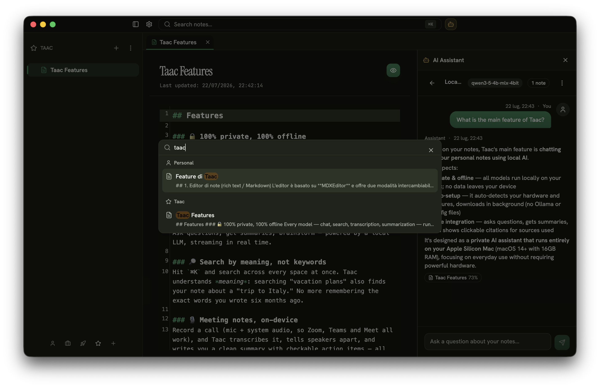
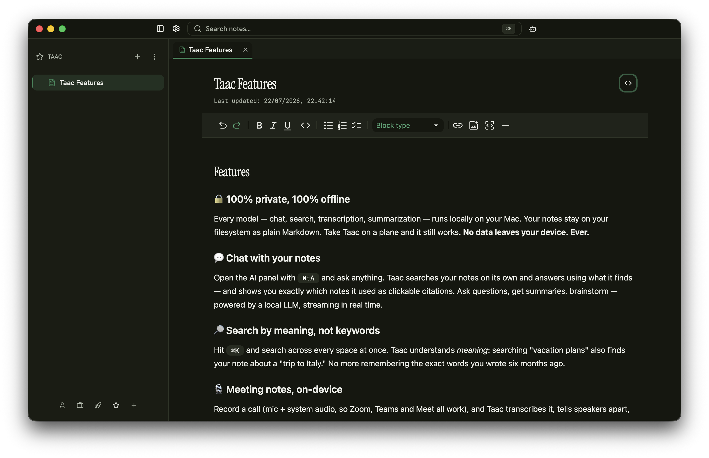
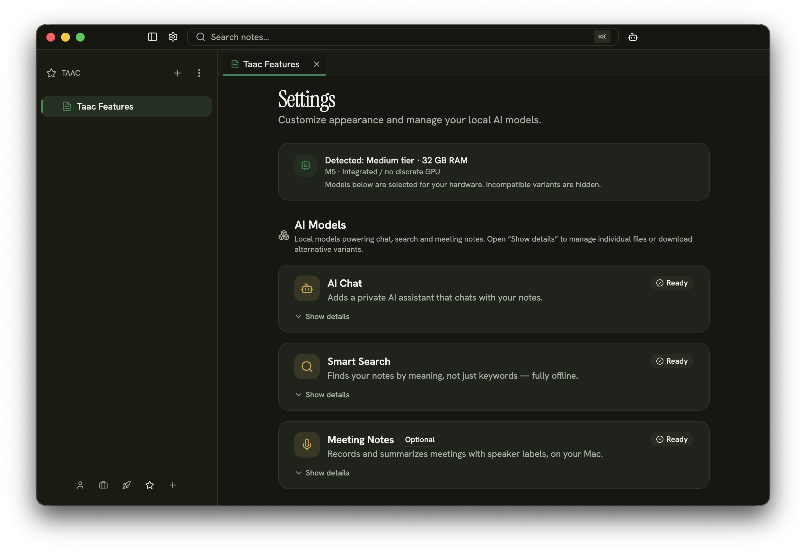

<!--
  ┌─────────────────────────────────────────────────────────────────────────┐
  │  VISUAL ASSETS — TO ADD BEFORE LAUNCH                                     │
  │  The repo has no screenshots/logo yet. Replace the placeholders below.   │
  │  Capture checklist:                                                       │
  │   • hero.png / logo — brand mark (current identity: serif italic "t"     │
  │     on a gradient tile, see WelcomeStep.tsx). App icon: build/icon.png   │
  │   • demo.gif  (10–15s): write a note → ⌘⇧A chat → answer with citations  │
  │   • chat.png  — AI chat panel with clickable source chips                 │
  │   • search.png — ⌘K cross-space semantic search                          │
  │   • meeting.png — meeting note: summary + action items + speaker labels   │
  │   • editor.png — WYSIWYG markdown editor                                  │
  │   • models.png — Settings → AI Models with hardware-detection banner      │
  │  Also confirm the website URL (placeholder: https://usetaac.app).        │
  └─────────────────────────────────────────────────────────────────────────┘
-->

<h1>Taac</h1>

### Private AI notes that actually run on your Mac.

**No cloud. No setup. Nothing ever leaves your device.**

Taac is a note-taking app with a built-in AI that lives entirely on your machine —
chat with your notes, search by meaning, and turn meetings into summaries,
all fully offline. No API keys, no accounts, no "connect your OpenAI" step.

<!-- TODO: replace with real badges once the repo is public-ready -->

**[Download](https://github.com/impe93/taac/releases) · [Website](https://usetaac.app) · [Roadmap](#roadmap) · [FAQ](#faq)**

https://github.com/user-attachments/assets/4eacb02a-cd79-4c0f-a0e7-01b95ae0a86f

_Write a note, hit ⌘⇧A, and get an answer grounded in your own notes._

---

## Why Taac?

AI is genuinely useful for your notes — but today you get to pick your poison:

- **The convenient way** sends everything you write to someone else's servers. Your journal, your meeting notes, your half-formed ideas — all uploaded, logged, and used to train who-knows-what.
- **The private way** means wrestling with terminals, Ollama, model files and API configs just to ask a question. Great if you're an engineer with a weekend to spare. Useless for everyone else.

**Taac gives you both: real, private AI that just works.** Download the app, click the features you want, and the models install themselves in the background. That's it. No cloud, no command line, no compromise — and it's tuned to run on a normal Mac, not a $5,000 workstation.

---

## Features

### 🔒 100% private, 100% offline
Every model — chat, search, transcription, summarization — runs locally on your Mac. Your notes stay on your filesystem as plain Markdown. Take Taac on a plane and it still works. **No data leaves your device. Ever.**

### 💬 Chat with your notes
Open the AI panel with `⌘⇧A` and ask anything. Taac searches your notes on its own and answers using what it finds — and shows you exactly which notes it used as clickable citations. Ask questions, get summaries, brainstorm — powered by a local LLM, streaming in real time.

### 🔎 Search by meaning, not keywords
Hit `⌘K` and search across every space at once. Taac understands *meaning*: searching "vacation plans" also finds your note about a "trip to Italy." No more remembering the exact words you wrote six months ago.

### 🎙️ Meeting notes, on-device
Record a call (mic + system audio, so Zoom, Teams and Meet all work), and Taac transcribes it, tells speakers apart, and writes you a clean summary with checkable action items — all offline. Live transcription while you record on Apple Silicon. Recording a lecture or a course instead? Switch to "media" mode for study notes. **Your audio is never uploaded.**

<!--  -->

### ✍️ A writing experience you'll actually like
A rich Markdown editor with a live WYSIWYG mode and a raw-Markdown mode, one click apart. Images, code blocks with syntax highlighting for ~25 languages, links, lists — and it auto-saves as you type.

### 🗂️ Organized the way you think
Keep up to 5 fully isolated **Spaces** (work, personal, a side project…), each with its own name and icon. Nest notes in folders, drag & drop to reorganize, and open several notes at once in **tabs** — Obsidian-style, with `⌘W`, `⌘1–9` and `⌘⇧[ ]` shortcuts.

---

## Zero-setup AI

Most local-AI tools hand you a shopping list of models and a terminal. Taac doesn't.

When you open the app it **detects your hardware** and picks the right models for your Mac automatically — hiding anything that won't run well. Pick the features you want (chat, search, meetings), and everything **downloads in the background** with progress you can pause and resume. No Ollama. No API keys. No config files.

Under the hood, so you know what you're running:

| Feature | Runs locally | Size |
| --- | --- | --- |
| 💬 AI Chat | Qwen3.5 4B | ~2.7 GB |
| 🔎 Smart Search | EmbeddingGemma 300M + Qwen3 Reranker | ~0.9 GB |
| 🎙️ Meeting Notes _(optional)_ | Whisper + Qwen3-ASR, with speaker diarization | ~0.5–2.5 GB |

You only download what you use — start with just Chat, or skip AI entirely and use Taac as a great Markdown notes app.

---

## Requirements

> Today Taac is **macOS on Apple Silicon only**. Windows and Linux are on the [roadmap](#roadmap).

- 🖥️ **Apple Silicon Mac** (M1 or newer)
- 🧠 **16 GB of RAM**
- 🍎 **macOS 14 (Sonoma) or later** — some features (live transcription, the most detailed summaries) need macOS 15+

We deliberately target real, everyday Macs — you don't need a maxed-out machine to run private AI.

---

## Getting started

1. **[Download the latest release](https://github.com/impe93/taac/releases)** and drag Taac into Applications.
2. Open it and follow the short setup — pick your AI features and they'll download while you look around.
3. **Bring your existing notes.** Taac imports from **Apple Notes**, **Obsidian**, and **Joplin**, with a preview before anything is added.

That's the whole onboarding. Start writing.

---

## Roadmap

Taac is early, and this release is step one. Here's where we're headed:

- [ ] **1. Consolidation & bug-fixing** — polish and stability _(current focus)_
- [ ] **2. Windows release**
- [ ] **3. Linux release**
- [ ] **4. Sync across your devices** — open-source and self-hostable, up in one click, so your notes stay yours
- [ ] **5. Mobile companion app** — your notes in your pocket, synced privately
- [ ] **6. AI-powered to-do lists** — turn notes and meetings into things that actually get done

The theme won't change: whatever we add stays **local-first and private by default.** Sync is self-hostable on purpose — syncing your devices shouldn't mean handing your notes to us.

---

## Honest caveats

Taac just hit 1.0. It's genuinely useful every day — but I'd rather tell you where the rough edges are than pretend they aren't there.

- **It's young, so expect the occasional bug.** This is the first release and it's under active development. If something crashes or freezes, that's not you doing it wrong — it's early software. [Open an issue](https://github.com/impe93/taac/issues); it's the fastest way to get it fixed.

- **The first indexing can be slow.** If you import a big pile of notes during onboarding, Taac has to index all of them for semantic search, and that first pass takes a while. After that it's incremental — only the notes you've changed get re-indexed, automatically in the background (roughly every half hour) — so you never wait like that again.

- **"Offline" has two exceptions.** Everything you *do* in Taac runs on your Mac. But downloading the AI models needs a connection (once, up front), and the auto-updater pings GitHub to check for new versions. Neither ever sends your notes anywhere — but I'm not going to claim "zero network" when that isn't literally true.

- **Yes, it's Electron.** I know how the community feels about that. I built Taac on a stack I know well and can support properly, instead of chasing a lighter one I'd be learning as I went. In daily use I haven't hit any memory issues — but if you do, please tell me right away. I take it seriously.

---

## FAQ

<b>Is it really private? Does anything leave my device?</b>

No. Chat, search, transcription, speaker detection and summaries all run locally on your Mac. Your notes are stored on your own filesystem. Taac works with your Wi-Fi off — the only time it talks to the network is to download AI models and check for app updates.

<b>Do I need to be technical? Set up Ollama or API keys?</b>

No. There's no terminal, no Ollama, no API keys, no accounts. You download the app, click the features you want, and the models install themselves. If you can install a Mac app, you can use Taac.

<b>What hardware do I need? Will it run on my Mac?</b>

An Apple Silicon Mac (M1 or newer) with 16 GB of RAM, on macOS 14+. Taac detects your hardware and picks models that run well on it — no guesswork.

<b>Windows or Linux?</b>

Not yet — Taac is macOS-only today. Windows and Linux are next on the [roadmap](#roadmap).

<b>Is it free? Is it open source?</b>

Yes and yes. Taac is free and open source under the [AGPL-3.0 license](LICENSE).

<b>Can I import my existing notes?</b>

Yes — Taac imports from **Apple Notes**, **Obsidian**, and **Joplin**, with a preview before anything is added to a space.

<b>How big are the AI models? Will they eat my disk and RAM?</b>

You only download what you use. Chat is ~2.7 GB, Smart Search ~0.9 GB, and Meeting Notes is optional (~0.5–2.5 GB depending on quality). Taac picks sizes that fit your machine and lets you delete models you don't need.

<b>Does the meeting recorder upload my audio?</b>

No. Recording, transcription, speaker diarization and summarization all happen on your Mac. You can also choose whether to keep or discard the original audio afterwards.

<b>Does it work offline / on a plane?</b>

Yes. Once your models are downloaded, everything works with no internet connection.

---

## Contributing

Taac is open source and contributions are welcome — issues and ideas all help.

---

## License

Taac is licensed under the **[GNU AGPL-3.0-or-later](LICENSE)**.

The AI models and third-party libraries Taac downloads at runtime are covered by their own licenses — see [NOTICE.md](NOTICE.md) for details.

**Private AI, on your Mac, by default.**

[Download](https://github.com/impe93/taac/releases) · [Website](https://usetaac.app) · Local-first and private, by default. 🖤

